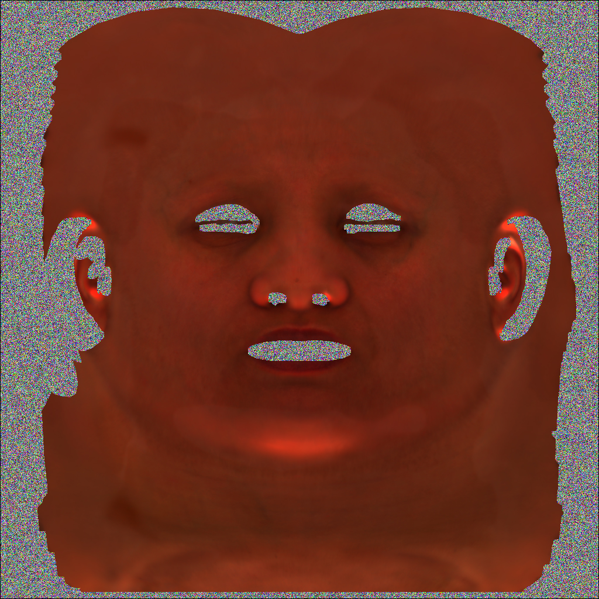
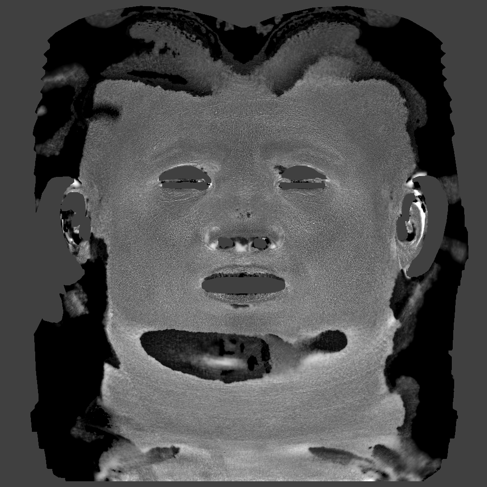
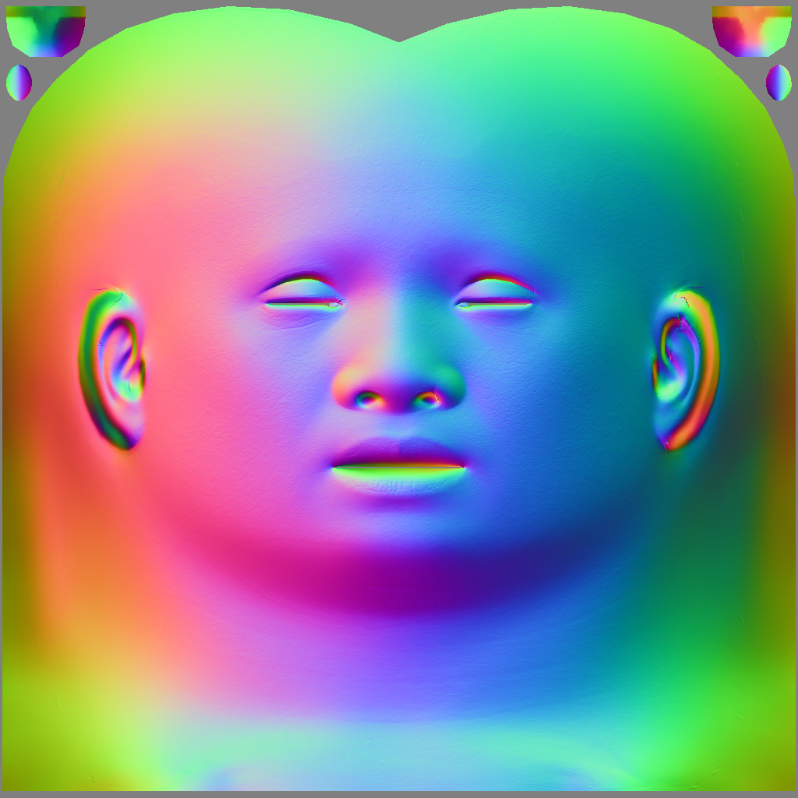
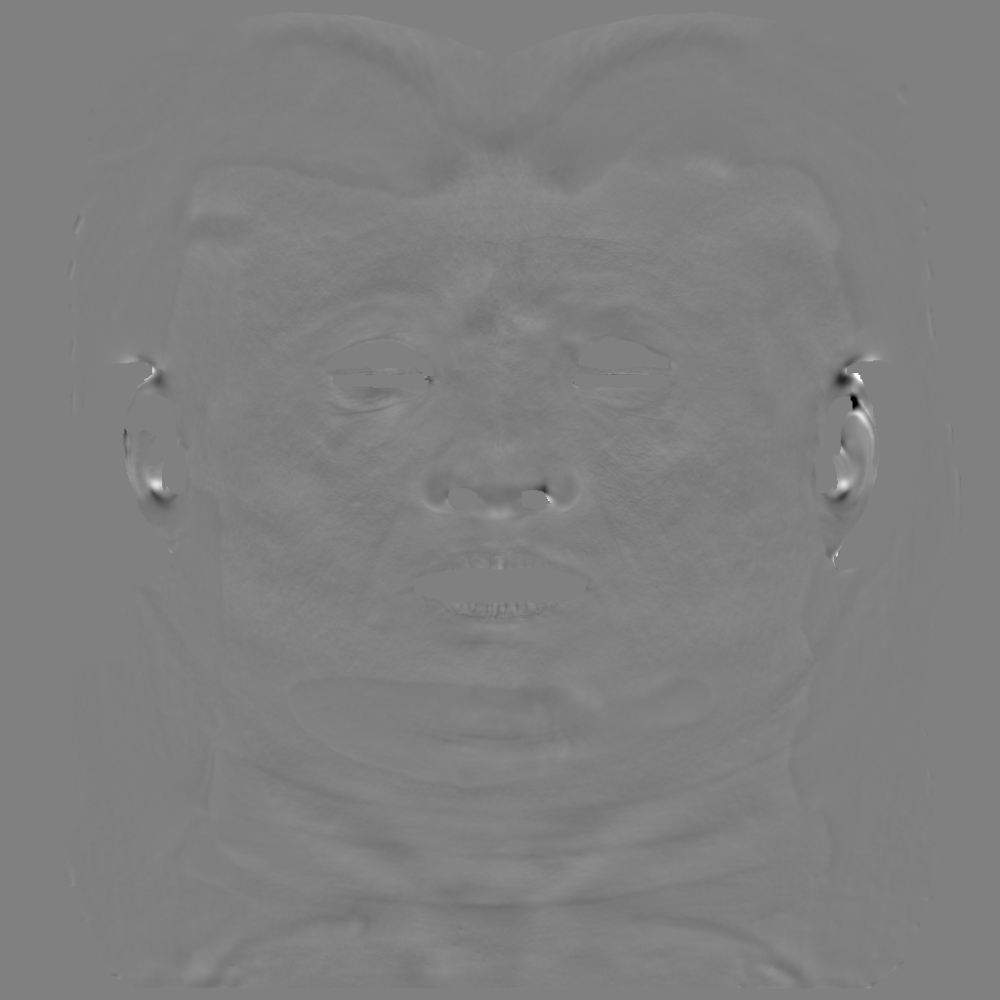

# FacialBRDFCapture
Personal implementation of disney's paper:  
2020, J Riviere et al., Single-Shot High-Quality Facial Geometry and Skin Appearance Capture  
https://www.youtube.com/watch?v=H_iiIl4EqHU

To apply the techniques discussed in the paper, a data preparation step is required to process the captured images. Although I implemented the data preparation step in a separate project, this repository will only include the main part of the paper. Instead, I will provide pre-processed data so that you can run the main algorithm directly. 

My implementation is different from the paper in that:
- I collected light samples from rectangular area lights instead of the environment light captured by a mirror ball, potentially introducing considerable errors due to the studio lights likely being positioned directly in front of the actor's face, while environment light models distant light sources.
- I used GGX brdf models instead of two lobes Phong model.
- I solved for roughness, specular scale, or both (controlled by flags), whereas the paper only addresses specular scale.
- I implemented significantly more regularization terms than those discussed in the paper.
- Cross-polarization is not considered, as we assume a carefully designed number of cameras in a single shot, which should be sufficient for separating diffuse and specular components.
- Subsurface scattering approximation is not considered.

## Reference
2018, P Gotardo et al., Practical Dynamic Facial Appearance Modeling and Acquisition  
2020, J Riviere et al., Single-Shot High-Quality Facial Geometry and Skin Appearance Capture  
2022, D Azinović et al., High-Res Facial Appearance Capture from Polarized Smartphone Images  

## Build Requirements
* Microsoft's Visual Studio 2019 or newer
* Google's ceres solver

This project is designed for Windows environments, but I believe that adapting it to other environments would require minimal effort, as it relies very little on Windows-specific dependencies, except for the macro DEFINE_ENUM_FLAG_OPERATORS which helps bitflag operations for enum.

The easiest method for installing Ceres Solver on Windows is through vcpkg:  
http://ceres-solver.org/installation.html

## Pipeline

## Final output (zoom in)

